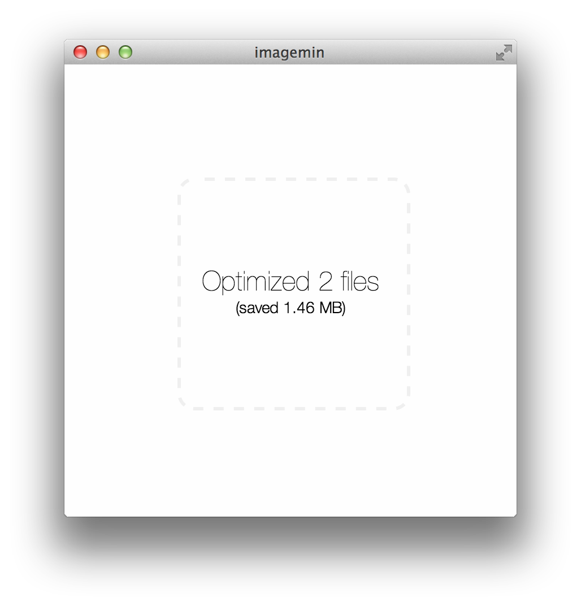

#  

> [imagemin](https://github.com/imagemin/imagemin-app) as an OS X, Linux and Windows app


This project is modified to use electron
and imagemin-jpeg-recompress 

## Install

run it manually follow the instructions below:

```sh
$ git clone https://github.com/zengde/imagemin-app.git
$ cd imagemin-app
$ npm install && npm start
```

Or build a binary with [electron-packager](https://github.com/electron-userland/electron-packager
)
```sh
npm install electron-packager -g
cd imagemin-app
electron-packager . 
```
after while open imagemin-app.exe in directory(example:imagemin-app-win32-x64) create by electron-packager to launch app.

The path to electron differs depending on your OS. Read the [docs](https://github.com/electron/electron/blob/master/docs/tutorial/quick-start.md)
to find out how.

## Debug in Vscode

1. Make sure to the latest version of [Debugger for Chrome](https://marketplace.visualstudio.com/items?itemName=msjsdiag.debugger-for-chrome) extension installed in VS Code.

2. Click on the Debugging icon in the Activity Bar to bring up the Debug view.
Then select Debugging of the renderer process to start Debug app.

look [vscode-electron-debug](https://github.com/octref/vscode-electron-debug/blob/master/README.md) and [Application Debugging](https://github.com/electron/electron/blob/master/docs/tutorial/application-debugging.md) for debug details

## Related

- [imagemin CLI](https://github.com/kevva/imagemin#cli)
- [gulp-imagemin](https://github.com/sindresorhus/gulp-imagemin)
- [grunt-contrib-imagemin](https://github.com/gruntjs/grunt-contrib-imagemin)


## License

MIT © [imagemin](https://github.com/imagemin)
